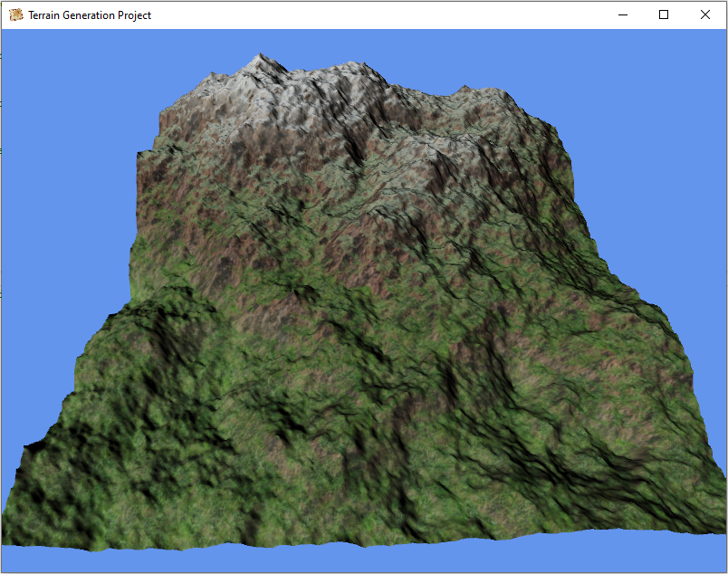
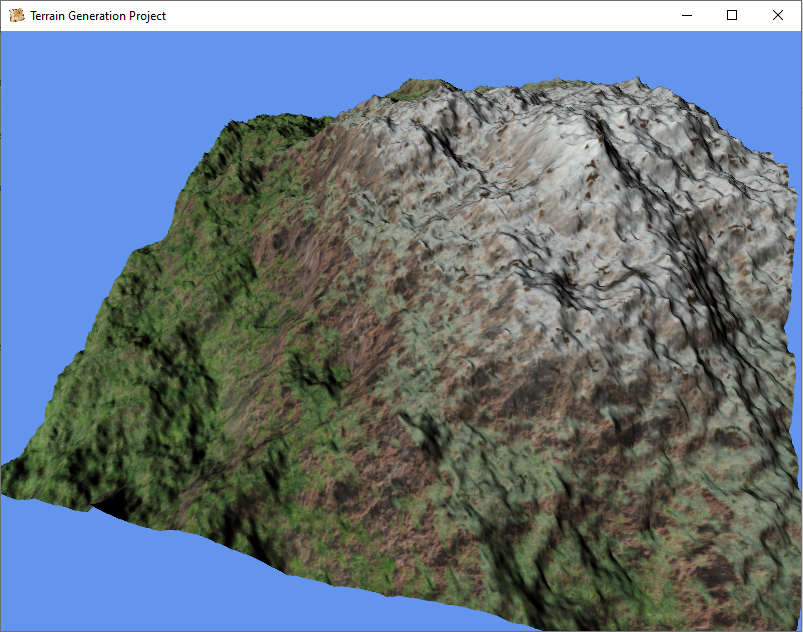
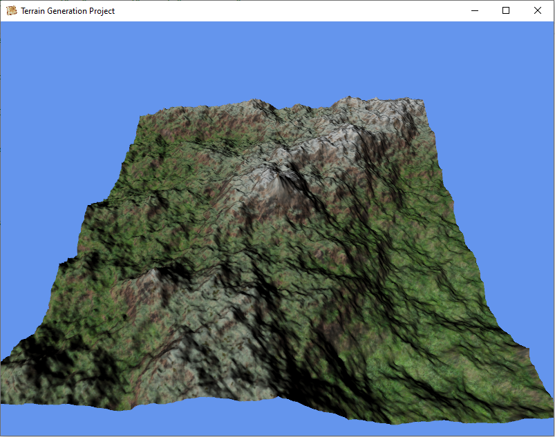

# Terrain Project

This was a final project for a computer graphics class that we made together. It generates a random terrain using the diamond-square algorithm. The results are textured based on elevation and slope. It's written in C# using OpenTK. 

